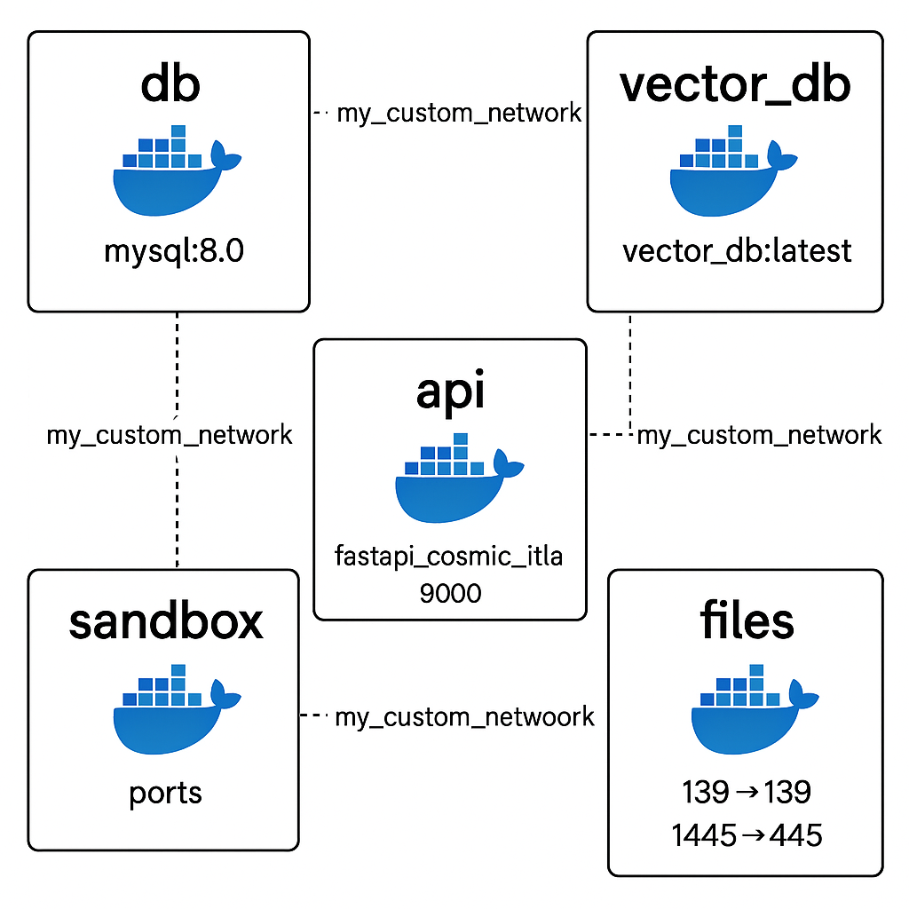
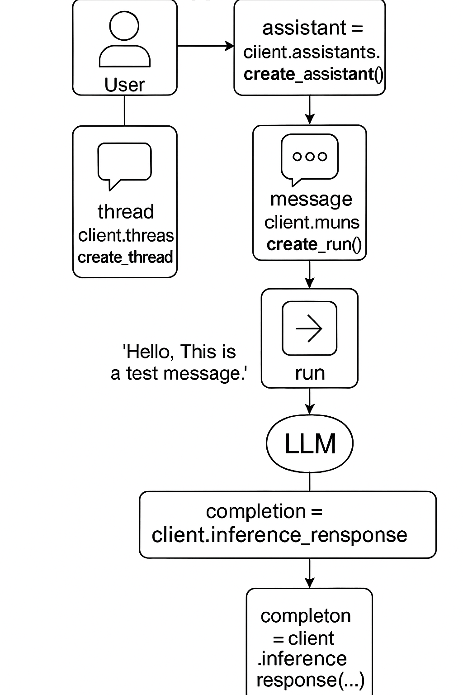

#  Entities V1

The **Entities API** is for developing projects that interact with LLMs.  
It aggregates inference calls to multiple providers as well as local using the [Ollama](https://github.com/ollama) library.

This enables rapid and flexible deployment of advanced features such as conversation management,  
[function calling](/docs/function_calling.md), [code interpretation](/docs/code_interpretation.md), and more through easy-to-use API endpoints.

---




---


## 🔍 Entities vs. LangChain (and Friends)

| Feature                          | **Entities**                                    | LangChain / Others                     |
|----------------------------------|-------------------------------------------------|----------------------------------------|
| **Design Philosophy**            | Systems-level, composable, and user-controlled  | Framework-heavy, opinionated, abstract |
| **Interface Style**              | Explicit class-based SDK + REST API             | Chained declarative syntax             |
| **Vector Store Logic**           | Custom embeddings + Qdrant via HTTPx            | Plug-and-play vector wrappers          |
| **Tool Use & AI Calls**          | Native function calling + structured streaming  | Wrapper-based toolchains               |
| **Security Model**               | Firejail sandbox, subprocess isolation          | None / minimal                         |
| **Licensing Philosophy**         | Open-use, revenue-share model                   | Varies (often restrictive)             |
| **Docker Architecture**          | DevOps-ready, containerized, bootstrap-aware    | Rarely production-oriented             |
| **Local LLM Support**            | Ollama integration (opt-in)                     | Often cloud-dependent                  |
| **Buzzword Compliant**           | ❌ No agents, chains, or gimmicks               | ✅ All the latest acronyms             |

---

##  Why Entities?

> Entities is a **developer-native**, **security-conscious**, and **deeply composable AI framework** built for:
>
> - People who want to **own their stack**
> - Teams building **real-world intelligent assistants**
> - Engineers who prefer **systems control over chained magic**

You don’t “add a tool to a chain.”  
You **register tools, trigger runs, stream thoughts, and command vector memory.**

---

## Supported Inference Providers

| Provider                                        | Type                        |
|-------------------------------------------------|-----------------------------|
| [Ollama](https://github.com/ollama)             | **Local** (Self-Hosted)     |
| [DeepSeek](https://platform.deepseek.com/)      | **Cloud** (Open-Source)     |
| [Hyperbolic](https://hyperbolic.xyz/)           | **Cloud** (Proprietary)     |
| [OpenAI](https://platform.openai.com/)          | **Cloud** (Proprietary)     |
| [together.ai](https://www.together.ai/)         | **Cloud** (Aggregated)      |
| [MS Azure Foundry](https://azure.microsoft.com) | **Cloud** (Enterprise)      |

---

## Security Model 

Entities places security at the forefront, employing:

- **Firejail Sandboxing**: Limits system access during code interpretation and local execution.
- **Subprocess Isolation**: Ensures code executions cannot interfere with core API logic, providing robust protection in multi-user environments.

This combination makes Entities highly suitable for secure deployments in sensitive, regulated environments.

---

## State Management

Advanced LLM applications require state management, which isn't always trivial.  
Entities simplifies dialogue management with the [Threads](/docs/threads.md) endpoint by standardizing storage and retrieval procedures.

Example dialogue array:

```json
[
  {"role": "system", "content": "You are a helpful assistant."},
  {"role": "user", "content": "What’s the capital of France?"},
  {"role": "assistant", "content": "The capital of France is Paris."},
  {"role": "user", "content": "What’s the population of Paris?"},
  {"role": "assistant", "content": "Approximately 2.1 million."}
]
```

---



---

## Documentation

### Getting Started & Basic Concepts

- [Assistants](https://github.com/frankie336/projectdavid/blob/master/docs/assistants.md)  
- [Threads](https://github.com/frankie336/projectdavid/blob/master/docs/threads.md)  
- [Messages](https://github.com/frankie336/projectdavid/blob/master/docs/messages.md)  
- [Runs](https://github.com/frankie336/projectdavid/blob/master/docs/runs.md)  
- [Inference](https://github.com/frankie336/projectdavid/blob/master/docs/inference.md)  
- [Streaming](https://github.com/frankie336/projectdavid/blob/master/docs/streams.md)  


---

### Security & Privacy
- [Security](/docs/security_privacy_section.md.md) 
---

### Integration Status 
- [Integration](/docs/model_integration_status.md) 


### Advanced Features

- [Function Calling](https://github.com/frankie336/projectdavid/blob/master/docs/function_calling.md)  
- [Code Interpretation](https://github.com/frankie336/projectdavid/blob/master/docs/code_interpretation.md)  

### Data & Vector Storage

- [Files](/docs/files.md)  
- [Vector Store](https://github.com/frankie336/projectdavid/blob/master/docs/vector_store.md)  

### Infrastructure & Management

- [Database](/docs/database.md)  
- [Docker Containers](/docs/docker_containers.md)  
- [Tools](/docs/tools.md)  
- [Users](/docs/users.md)


## Endpoint Documentation 🌐

- [altredoc](http://your-domain/altredoc/)
- [Swagger](http://your-domain/mydocs#/)

---

## Starting Docker Containers 🐳

Use `start.py` to simplify building images, starting/stopping containers, and managing volumes.

Default orchestration:
```bash
python start.py
```

Skip orchestration:
```bash
python start.py --no-orchestrate
```

**Run with Ollama** (optional local inference):

```bash
python start.py --with-ollama
# GPU acceleration
python start.py --with-ollama --ollama-gpu
```

**Docker lifecycle commands**:

- **Bring up containers**: `python start.py --mode up`
- **Build Docker images**: `python start.py --mode build`
- **Build & bring up**: `python start.py --mode both`
- **No-cache build**: `python start.py --mode build --no-cache`
- **No-cache build & up**: `python start.py --mode both --no-cache`
- **Clear volumes & restart**: `python start.py --mode up --clear-volumes`
- **Stop containers**: `python start.py --down`
- **Stop & clear all data**: `python start.py --down --clear-volumes`
- **Debug cache/docker health**: `python start.py --debug-cache`

#### Build specific servies

- **Build the main api**:`python start.py --mode build --services api`
- **Build the main db**:`python start.py --mode build --services db`
- **Build the vector db**:`python start.py --mode build --services qdrant`
- **Build the sandbox**:`python start.py --mode build --services sandbox`
- **Build the file server**:`python start.py --mode build --services samba`
---

