### KEY ISOLATION POINTS:

### KEY ISOLATION POINTS:

1. Worker's internal tool calls (perform_web_search, read_web_page, etc.)
   stay ONLY in ephemeral_thread - NEVER bleed into main thread

2. Only the FINAL assistant message content from worker is extracted
   via messages_on_thread[-1].get('content')

3. This clean report is submitted as tool response to supervisor

4. Supervisor sees ONLY the final report, not the worker's tool execution

### THREAD CONTEXTS:

Main Thread Context (Supervisor sees):
  - User: "Find NVIDIA Q4 2024 revenue"
  - Assistant: <tool_call: delegate_research_task>
  - Tool: "NVIDIA fiscal Q4 2024 revenue was $26.04B..." ✓ CLEAN
  - Assistant: [Final synthesis to user]

Worker Thread Context (Isolated):
  - User: "### Research Assignment..."
  - Assistant: <tool_call: perform_web_search>
  - Tool: [search results]
  - Assistant: <tool_call: read_web_page>
  - Tool: [page content]
  - Assistant: "NVIDIA fiscal Q4 2024..." ← EXTRACTED