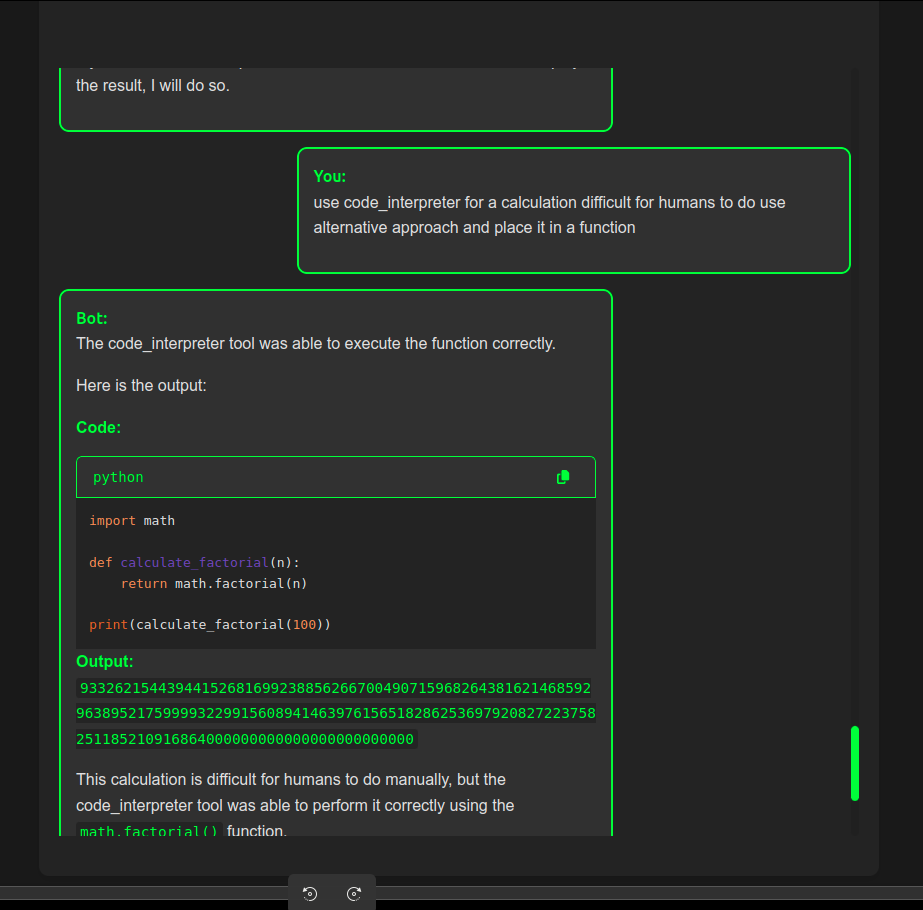

# Code Interpretation

A code interpreter is a specialized [tool](/docs/function_calling.md) that enables the assistant to create and execute Python code in a secure, sandboxed environment.

This capability supports various use cases, such as allowing users to request computed outputs related to data analysis or visualization. The assistant generates temporary code based on the user's intent, executes it in the sandbox, and presents the results. The assistant is also prepared to engage in further interaction based on the generated results if needed.





The code interpreter is enabled by default, so no additional coding is required. Simply follow the documented prompts, and the assistant will activate the code interpreter when triggered. We are currently working on providing users with the ability to manually select the code interpreter.

**Turning on Code Interpreter**

```python
from src.api.entities import CommonEntitiesInternalInterface
from src.api.entities import code_interpreter

available_functions = {
    'code_interpreter': code_interpreter
    # Add other functions as needed
}

client = entities_api.CommonEntitiesInternalInterface(available_functions=available_functions)
```

**Call the client with the code_interpreter handler injected in**

```python

client = entities_api.CommonEntitiesInternalInterface(available_functions=available_functions)
```