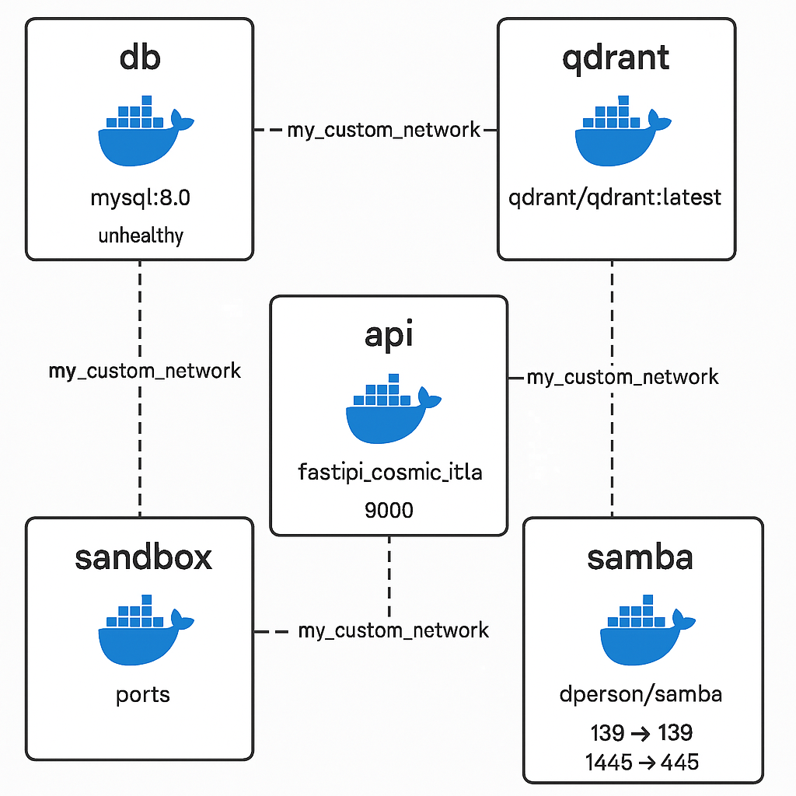

# Docker Containers 

## Overview

This project utilizes a multi-container Docker architecture to provide a robust and scalable application environment. The containerized services include:

MySQL Database (my_mysql_cosmic_catalyst): A MySQL 8.0 container that handles all persistent data storage.

Qdrant Vector Search (qdrant_server): A container running the latest Qdrant image to manage vector searches for advanced data retrieval.

API Server (fastapi_cosmic_catalyst): A FastAPI-based service responsible for handling client requests and business logic.

Sandbox Environment (sandbox_api): A secure, isolated container for executing code and testing new features without affecting production.

Samba File Sharing (samba_server): A Samba server container that provides file sharing capabilities, ensuring efficient storage management.

All these containers are networked through a custom Docker bridge network, ensuring seamless communication and integrated operation across the system.

