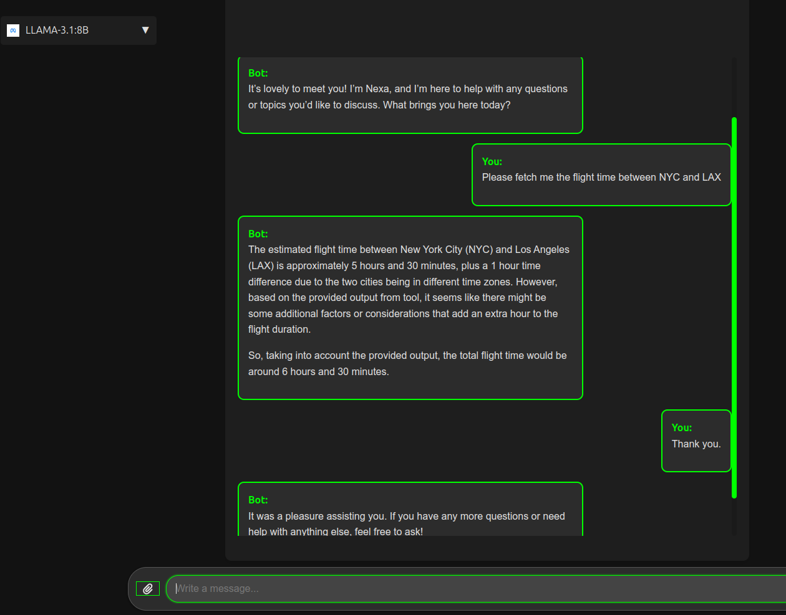

# Function Calling

## Overview

Function calling allows your assistant to interact with defined tools, enabling dynamic and computed responses based on user inputs. This section guides you through defining, associating, updating, and deleting functions within your API, as well as integrating these functions into your projects.


**Define the function**

```python
from src.api.entities import CommonEntitiesInternalInterface
from src.api.entities import ToolFunction  # Import ToolFunction

# Initialize the client
client = CommonEntitiesInternalInterface()

# Create assistant
assistant = client.assistant_service.create_assistant(
   user_id=user.id,
   name='Flighty',
   description='test_case',
   model='llama3.1',
   instructions='You are a helpful flight attendant'
)
print(f"Assistant created: ID: {assistant.id}")

# Define the function definition
function_definition = {
   "type": "function",
   "function": {
      "name": "get_flight_times",
      "description": "Get the flight times between two cities.",
      "parameters": {
         "type": "object",
         "properties": {
            "departure": {
               "type": "string",
               "description": "The departure city (airport code)."
            },
            "arrival": {
               "type": "string",
               "description": "The arrival city (airport code)."
            }
         },
         "required": ["departure", "arrival"]
      }
   }
}

# Wrap the function definition in ToolFunction
tool_function = ToolFunction(function=function_definition['function'])

# Create a new tool with the name included
new_tool = client.tool_service.create_tool(
   name=function_definition['function']['name'],  # Pass the tool name explicitly
   type='function',
   function=tool_function,  # Pass the wrapped ToolFunction
   assistant_id=assistant_id
)

print(new_tool.id)

```

**Explanation**

1. Initialize the Client: Connect to the `CommonEntitiesInternalInterface` to interact with the API services.

    2. Create a User: Instantiate a user who will own the assistant.

    3. Create an Assistant: Set up an assistant with specific attributes and instructions.

    4. Define the Function: Specify the function's purpose, name, description, and required parameters.

    5. Wrap and Create the Tool: Encapsulate the function definition in a `ToolFunction` and register it as a new tool associated with the assistant.


**Associate the new Tool with an Assistant**

```python


# Associate the tool with an assistant
client.tool_service.associate_tool_with_assistant(
    tool_id=new_tool.id,
    assistant_id=assistant.id
)

print(f"New tool created: Name: {function_definition['function']['name']}, ID: {new_tool.id}")
print(new_tool)
```
**Note:** The same tool can be associated to multiple [assistants](/docs/assistants.md).


# Updating a Tool

**Define the new function definition for updating**
```python
new_function_definition = {
    "type": "function",
    "function": {
        "name": "get_flight_times",
        "description": "Retrieve updated flight times between two cities.",
        "parameters": {
            "type": "object",
            "properties": {
                "departure": {
                    "type": "string",
                    "description": "The departure city (airport code)."
                },
                "arrival": {
                    "type": "string",
                    "description": "The arrival city (airport code)."
                },
                "date": {
                    "type": "string",
                    "description": "The date for the flight times (YYYY-MM-DD)."
                }
            },
            "required": ["departure", "arrival", "date"]
        }
    }
}

# Specify the tool ID to update
tool_id = new_tool.id

# Create a ToolUpdate instance with the new function definition
tool_update = ToolUpdate(function=ToolFunction(function=new_function_definition['function']))

# Update the tool
try:
    updated_tool = client.tool_service.update_tool(tool_id=tool_id, tool_update=tool_update)
    print(f"Tool updated successfully: {updated_tool}")
except Exception as e:
    print(f"Failed to update tool: {str(e)}")
```
**Explanation**

1. Define New Function Parameters: Add or modify parameters as needed.
    
    2. Create ToolUpdate Instance: Wrap the new function definition in `ToolFunction` and prepare the update payload.
    
    3. Apply the Update: Execute the update and handle potential exceptions.


**Deleting a tool**

```python
client.tool_service.disassociate_tool(
        tool_id=new_tool.id,
    )

```


**Disassociate the new Tool with an Assistant**

```python

client.tool_service.disassociate_tool_from_assistant(
    tool_id=new_tool.id,
    assistant_id=assistant.id
)

print(f"New tool created: Name: {function_definition['function']['name']}, ID: {new_tool.id}")
print(new_tool)
```


# Using a Function Call in a Project

The following code should be implemented on your back end or other project source where you hope to trigger function calls.


**A simulated API call that fetches flight details**

```python

def get_flight_times(departure: str, arrival: str) -> str:
    flights = {
        'NYC-LAX': {'departure': '08:00 AM', 'arrival': '11:30 AM', 'duration': '6h 30m'},
        'LAX-NYC': {'departure': '02:00 PM', 'arrival': '10:30 PM', 'duration': '5h 30m'},
        'LHR-JFK': {'departure': '10:00 AM', 'arrival': '01:00 PM', 'duration': '8h 00m'},
        'JFK-LHR': {'departure': '09:00 PM', 'arrival': '09:00 AM', 'duration': '7h 00m'},
        'CDG-DXB': {'departure': '11:00 AM', 'arrival': '08:00 PM', 'duration': '6h 00m'},
        'DXB-CDG': {'departure': '03:00 AM', 'arrival': '07:30 AM', 'duration': '7h 30m'},
    }
    key = f'{departure}-{arrival}'.upper()
    return json.dumps(flights.get(key, {'error': 'Flight not found'}))

```

**Set the functions that you want to make available to the assisant**

```python
available_functions = {
    'get_flight_times': get_flight_times
    # Add other functions as needed
}

```

**available_functions is an optional parameter when you call the api client**

```python
client = entities_api.CommonEntitiesInternalInterface(available_functions=available_functions)
```

**A back end handler for making calls to the API**

```python
def get_flight_times(departure: str, arrival: str) -> str:
    flights = {
        'NYC-LAX': {'departure': '08:00 AM', 'arrival': '11:30 AM', 'duration': '6h 30m'},
        'LAX-NYC': {'departure': '02:00 PM', 'arrival': '10:30 PM', 'duration': '5h 30m'},
        'LHR-JFK': {'departure': '10:00 AM', 'arrival': '01:00 PM', 'duration': '8h 00m'},
        'JFK-LHR': {'departure': '09:00 PM', 'arrival': '09:00 AM', 'duration': '7h 00m'},
        'CDG-DXB': {'departure': '11:00 AM', 'arrival': '08:00 PM', 'duration': '6h 00m'},
        'DXB-CDG': {'departure': '03:00 AM', 'arrival': '07:30 AM', 'duration': '7h 30m'},
    }
    key = f'{departure}-{arrival}'.upper()
    return json.dumps(flights.get(key, {'error': 'Flight not found'}))

```

**Note:** Function calls and responses will now be dynamically injected into coversation dialogue.

See [here](/docs/assistants.md) for the complete end-to-end logic of sending a message to trigger a response once you have implemented the instructions above.





