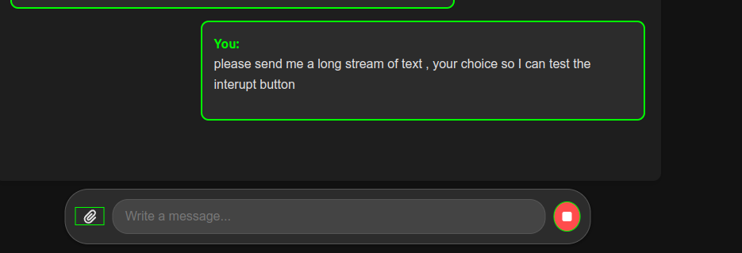

# Runs

## Overview

Runs track the state of nine steps within the user prompt and assistant response life cycle. Creating and processing a run is the final stage in establishing state information for each message and response from the assistant. This system provides a flexible interface for programmatic access, making it adaptable for any type of LLM project.


| **Status**         | **Definition**                                                                                                                                                                                                                                                                 |
|--------------------|---------------------------------------------------------------------------------------------------------------------------------------------------------------------------------------------------------------------------------------------------------------------------------|
| **queued**         | When Runs are first created or when you complete the `required_action`, they are moved to a queued status. They should almost immediately move to `in_progress`.                                                                                                                |
| **in_progress**    | While in progress, the Assistant uses the model and tools to perform steps. You can view progress being made by the Run by examining the Run Steps.                                                                                                                             |
| **completed**      | The Run successfully completed! You can now view all Messages the Assistant added to the Thread, and all the steps the Run took. You can also continue the conversation by adding more user Messages to the Thread and creating another Run.                                  |
| **requires_action**| When using the Function calling tool, the Run will move to a `requires_action` state once the model determines the names and arguments of the functions to be called. You must then run those functions and submit the outputs before the run proceeds.                           |
| **expired**        | This happens when the function calling outputs were not submitted before `expires_at` and the run expires. Additionally, if the run takes too long to execute and goes beyond the time stated in `expires_at`, the system will expire the run.                                 |
| **cancelling**     | You can attempt to cancel an `in_progress` run using the Cancel Run endpoint. Once the attempt to cancel succeeds, the status of the Run moves to `cancelled`. Cancellation is attempted but not guaranteed.                                                                    |
| **cancelled**      | Run was successfully cancelled.                                                                                                                                                                                                                                                |
| **failed**         | You can view the reason for the failure by looking at the `last_error` object in the Run. The timestamp for the failure will be recorded under `failed_at`.                                                                                                                    |
| **incomplete**     | Run ended due to `max_prompt_tokens` or `max_completion_tokens` being reached. You can view the specific reason by looking at the `incomplete_details` object in the Run.                                                                                                       |


**Create a Run**

```python
from src.api.entities import CommonEntitiesInternalInterface

run = client.run_service.create_run(thread_id=thread.id,
                                    assistant_id=user.id)


```


**Inference**

Once a run and its preceding states have been set up, the final stage is inference – the process of sending a prompt to the assistant and receiving a reply. The Entities API supports both edge device inference and cloud-based hosted inference. While we recommend local inference for maximum security and privacy, very high-performance inference is often not feasible on edge devices.

The Entities API is seamlessly integrated into the [Groq](https://groq.com/) compute ecosystem. For instructions on setting up edge or cloud inference, please refer to the relevant [documentation](/docs/infernce.md) .


**For Streamed responses**
```python
import json

for chunk in client.runner.process_conversation(thread_id=thread_id, message_id=message_id, run_id=run_id,
                                                assistant_id=assistant, model=selected_model):


    
    json_chunk = {"chunk": chunk}
    print(f"data: {json.dumps(json_chunk)}\n\n")
                                                assistant_id=assistant.id, model=selected_model):

```


**Retrieve a Run**
```python
print(get_run.dict())
id='run_t16pOsi0Y2a3PXuPjcrjko' assistant_id='user_2uMMGBpU4H7dcZieeOahNv' cancelled_at=None completed_at=None created_at=1726617356 expires_at=1726620956 failed_at=None incomplete_details=None instructions='' last_error=None max_completion_tokens=1000 max_prompt_tokens=500 meta_data={} model='gpt-4' object='run' parallel_tool_calls=False required_action=None response_format='text' started_at=None status='queued' thread_id='thread_Ww3UGvvKkrxFfHD1hNFQVX' tool_choice='none' tools=[] truncation_strategy={} usage=None temperature=1.0 top_p=1.0 tool_resources={} actions=[]
{'id': 'run_xsDpDica9weXH4eSfsRcPd', 'assistant_id': 'user_0D1D7j6UkZUsa9Gm7GdkU1', 'cancelled_at': None, 'completed_at': None, 'created_at': 1726620075, 'expires_at': 1726623675, 'failed_at': None, 'incomplete_details': None, 'instructions': '', 'last_error': None, 'max_completion_tokens': 1000, 'max_prompt_tokens': 500, 'meta_data': {}, 'model': 'gpt-4', 'object': 'run', 'parallel_tool_calls': False, 'required_action': None, 'response_format': 'text', 'started_at': None, 'status': 'queued', 'thread_id': 'thread_VaTTuMUa8EHtkr60hZGkju', 'tool_choice': 'none', 'tools': [], 'truncation_strategy': {}, 'usage': None, 'temperature': 1.0, 'top_p': 1.0, 'tool_resources': {}, 'actions': []}
```

**Cancel a Run**
```python

# Attempt to cancel the run
client.run_service.cancel_run(run_id=run_id)

```

**Example use case**



The cancel method in the Run end point can be leveraged to create an interrupt button in the user interface app of a chat bot.